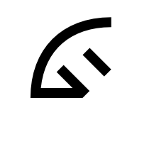
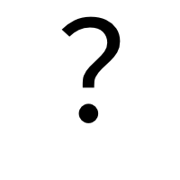
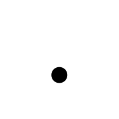

# Sol

Sol is a phonetic letterset whose goal is to represent spoken languages (primarily English) while eliminating the ambiguities and confusing nature of the traditional Latin alphabet.

The name "Sol" is an acronym:

**Structured**: Sol's letters are born from structures called [starbursts](#starbursts) which help make Sol easy to learn.

**Orthographic**: Each of Sol's letters always makes exactly one sound, regardless of context, and no two letters make the same sound.

**Letterset**: While Sol is technically an "alphabet," the more general term "letterset" was chosen to distance Sol from the expectations of conventional alphabets.

## Reference Table

Sol's letters are shown below [in order](#ordering). Use the [Solat](#solat) column with the [fonts](fonts) included in this repo to see which Latin keyboard sequence will yield the corresponding letter. Click on a letter to view a larger image.

| Letter                                            | Solat | Latin Example     |
| :------------------------------------------------ | :---- | :---------------- |
|  | `h`   | ***h***ot         |
|  | `a`   | ***a***pple       |
|  | `e`   | p***e***t         |
|  | `i`   | s***i***t         |
|  | `ah`  | h***o***t         |
|  | `u`   | h***u***t         |
|  | `uu`  | p***u***t         |
|  | `w`   | ***w***et         |
|  | `o`   | n***o***          |
|  | `oo`  | f***oo***d        |
|  | `y`   | ***y***es         |
|  | `ee`  | m***ee***t        |
|  | `ey`  | n***a***me        |
|  | `ahy` | l***i***ke        |
|  | `yoo` | h***u***ge        |
|  | `b`   | ***b***uy         |
|  | `p`   | ***p***ay         |
|  | `d`   | ***d***ay         |
|  | `j`   | ***j***am         |
|  | `jh`  | fu***si***on      |
|  | `t`   | ***t***en         |
|  | `thh` | ***th***is        |
|  | `tth` | ***th***ink       |
|  | `f`   | ***f***ar         |
|  | `v`   | ***v***ast        |
|  | `g`   | ***g***o          |
|  | `k`   | ***k***aya***k*** |
|  | `l`   | ***l***it         |
|  | `m`   | ***m***y          |
|  | `n`   | ***n***o          |
|  | `r`   | ***r***est        |
|  | `s`   | ***s***ay         |
|  | `z`   | ***z***oo         |
|  | `sh`  | ***sh***oe        |
|  | `ch`  | ***ch***at        |

## Writing in Sol

To write a word or phrase in Sol, break it down into its phonetic parts, then choose the appropriate letter from the [table above](#reference-table) for each part. Writing Sol is simple and straightforward, as there is no need to add complexities that exist in languages such as written English, like silent `e`s, doubled consonants, or nonsensical letter combinations (e.g. `igh` pronounced as a long `i`). Also see [Other Rules](#other-rules).

### Solat

In scenarios where it is not feasable or appropriate to write Sol with Sol's symbols, Sol can be written using Latin alphabetical symbols. This is called **Solat**. The [fonts](fonts) included in this repo use ligatures to detect typed Solat sequences ([case-insensitively](#capitalization)) and convert them to Sol symbols automatically.

### Examples

Below are some examples of English phrases written traditionally (i.e. with Latin symbols), with Solat symbols, and with Sol symbols:

| Phrase              | Solat        | Sol
| :------------------ | :----------- | :--
| Hello!              | !helo!      | 
| How are you?        | ?haw ahr yoo? | 
| I'm better, thanks. | ahy'm betr, ttheynks. | 

## Starbursts

Sol's letters are based around two "starbursts," the 8-pronged [consonant starburst](#consonants), and the 3-pronged [vowel starburst](#vowels).

### Consonants

_Click image to view full size_

The consonant letter symbols are derived from a combination of arcs and lines. Moving counter-clockwise around the starburst, the **base consonants** are formed by combining each quadrant's corresponding arc with the letter's corresponding prong. By always placing the prong to the right of the arc, horizontal symmetry is broken, eliminating the confusion that exists between horizontally-symmetric letters of the Latin alphabet, such as `b` and `d`.

Rather than following traditional alphabetical ordering, Sol groups its consonants around the eight **base consonants**. The remaining **derived consonants** are formed by small modifications of these bases. Specifically, to "harden" a base sound -- such as hardening `d` into `t` -- the base symbol's prong is typically doubled. To "buzz" a base sound -- such as buzzing `s` into `z` -- a vertical bar is typically added to the base symbol. Lastly, to "breathe" a base sound -- such as breathing `s` into `sh` -- a horizontal bar is added to the base symbol.

> **For the curious...**
>
> The above modifications -- harden, buzz, and breathe -- can be stacked. For instance, a hardened `d` produces a `t` sound. That `t` can then be breathed into a hard `th` sound (as in "think").
>
> A `d` sound that has been breathed but not first hardened will produce a soft `th` sound (as in "this").

Sol does not include traditional consonants `c`, `q`, or `x`, as their sounds can be achieved with existing letters.

Three other traditional consonants that are not included in Sol's consonant starburst are `h`, `w`, and `y`, as they form the basis for the [vowel starburst](#vowels).

### Vowels

_Click image to view full size_

The vowel starburst is formed by deriving each vowel from one of three sounds: `h`, `w`, or `y`. The long `o` and `oo` (as in "food") sounds branch from the `w` prong since they each end in a `w` sound. The short `a`, `e`, `i`, `o`, `u`, and `oo` (as in "book") sounds branch from the `h` prong since they each end in an `h` sound. Finally, the long `a`, `e`, and `i` sounds branch from the `y` prong since they each end in a `y` sound. The long `u` sound can be considered to branch from both the `y` and `w` branches, since it begins with a `y` sound and ends in a long `oo` sound, which itself branches from the `w` prong as mentioned previously.

> **For the curious...**
>
> The letters for the long `a`, `i`, and `u` sounds are simply ligatures of the letters for the short `e`, short `o`, and long `oo` sounds, respectively, and the letter for the `y` sound:
>
> Long `a`:
>
> `e` + `y` = `ey`
>
> 
>
> ---
>
> Long `i`:
>
> `ah` + `y` = `ahy`
>
> 
>
> ---
>
> Long `u`:
>
> `y` + `oo` = `yoo`
>
> 

## Ordering

Sol's letters are ordered by the following criteria, in order of precedence:

1. Starburst (vowels, then consonants)

1. Direction around starburst (CCW from top)

1. Derivative order

   _Vowels_:

   - `h`-prong order: `h`, `a`, `e`, `i`, `ah`, `u`, `uu`
   - `w`-prong order: `w`, `o`, `oo`
   - `y`-prong order: `y`, `ee`, `ey`, `ahy`
   - `yoo`

   _Consonants_ (recursively):

   1. Base

   1. Buzz

   1. Breathe

   1. Harden

## Other Rules

### Vowel Omission

Because Sol's letters map to sounds, and many sounds are traditionally spelled ambigiously in the context of a word -- such as the ending sounds of "barber" and "harbor" -- omit vowels where the expected pronunciation would already naturally occur. For instance, the previous examples would be spelled `bahrbr` and `hahrbr` in [Solat](#solat).

### Punctuation, Symbols, and Numbers

Punctuation such as `!` and `?` are placed on **both sides** of a sentence. This idea, borrowed from written languages like Spanish, gives the reader an early indication of a sentence's intonation.

All other punctuation marks, as well as symbols and numbers, are used as they are traditonally.

### Capital Letters

There are no capital letters in Sol. Instead, context is relied upon to convey ideas like proper nouns. If disambiguation is needed, periods may be used between letters of an acronym, and proper nouns may be underlined or otherwise emphasized.

### Symbol Width

Sol symbols, regardless of font, are intended to be fixed-width. This makes it easy to format content using spaces and tabs.

## License

Concept & Content: [CC BY 4.0](https://creativecommons.org/licenses/by/4.0/)

Fonts: [SIL Open Font License v1.1](http://scripts.sil.org/OFL)
